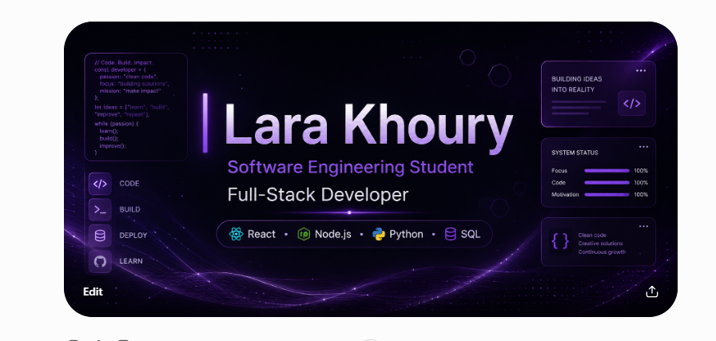

  

# 👩‍💻 Lara Khoury

### Software Engineering Student | Full-Stack Developer

**React • Node.js • Python • SQL**

---

## 👩‍💻 About Me

* 🎓 B.Sc. **Software Engineering student at the Technion**
* 💻 Interested in **Full-Stack Software Development**
* ⚛️ Building frontend applications with **React and JavaScript**
* 🟢 Developing backend applications using **Node.js and Express.js**
* 🗄️ Experienced with **MySQL, SQL, and MongoDB**
* 🧠 Strong foundation in **Object-Oriented Programming, C++, Java, and Python**
* 🐧 Familiar with **Linux, Git, and GitHub**
* 🌱 Continuously improving my software development and problem-solving skills

Currently looking for internship opportunities as a:

* Software Engineering Intern
* Full-Stack Developer Intern
* Frontend Developer Intern
* Backend Developer Intern

---

### 🏅 Certifications

* **C++ Essentials 1** — Cisco Networking Academy
* **C++ Essentials 2** — Cisco Networking Academy
* **Cisco Data Communications & Networking** — Cisco Networking Academy

---

## 🛠️ Tech Stack

### Languages

### Frontend

### Backend

### Databases

### Tools

 

| Category        | Technologies                                            |
| --------------- | ------------------------------------------------------- |
| **Frontend**    | HTML, CSS, JavaScript, React.js, Vite                   |
| **Backend**     | Node.js, Express.js, Java, Python                       |
| **Databases**   | MySQL, SQL, MongoDB                                     |
| **Programming** | C++, Java, Python, JavaScript                           |
| **Tools**       | Git, GitHub, Linux, VS Code                             |
| **Concepts**    | Object-Oriented Programming, REST APIs, Database Design |

---

## 📂 Featured Projects

### 🦷 Dental Clinic Management System

A full-stack web application designed for managing dental clinic operations.

* Built the frontend using **React and Vite**
* Developed the backend using **Node.js and Express.js**
* Integrated a **MySQL database**
* Implemented authentication and session management
* Structured the backend using controllers, routes, services, and middleware
* Used REST APIs for communication between frontend and backend
* Added frontend and backend testing

**Technologies:**
`React` `JavaScript` `Node.js` `Express.js` `MySQL` `Vite`

---

### 📖 Phone Book Application

An interactive contact-management web application.

* Add, edit, delete, and view contacts
* Search contacts by name
* Organize contacts into different categories
* Interactive and responsive user interface
* Built using vanilla JavaScript

**Technologies:**
`HTML` `CSS` `JavaScript`

---

## 🔗 Connect With Me

---

## 📊 GitHub Stats

  

---

### 💻 Building, learning, and improving one project at a time.

